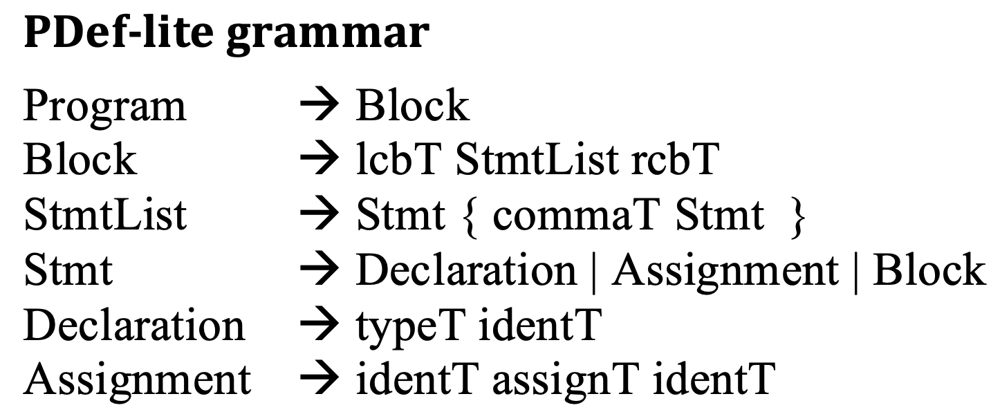
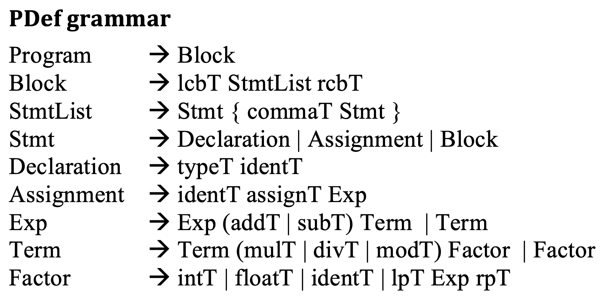

# PDef Parser

For this project, you will first complete the implementation of a parser for PDef-Lite, then extend that implementation for PDef. It is expected that you have read chapters 6, 11, and 13 of Programming Languages Through Translation. Chapter 13 provides the steps that you will be completing.

Read the instructions carefully. You will regret having a 'code first' mindset - design your project before you proceed.

Recall from your book that the grammar rules for PDef-Lite and PDef are as follows.





1. Edit `main()` in `PDef.java` so that the first line output is your name.

1. Complete Activity 37 (pg 225), Activity 38 (pg 227), and Activities 39-41 (pg 230). 

1. Test your parser using the PDefLite files from `Test-PDefL`. Some files are gramatically valid, others are not. Check the contents of each file to determine if your parser works as expected. Use the following to recompile:
   ```Console
   javac PDef.java */*.java
   java PDef input_test_file
   ```

1. Complete Activity 42 (pg 236).

1. Analyze the first/follow sets for each nonterminal.

1. Complete Activity 43 (pg 237-8). 